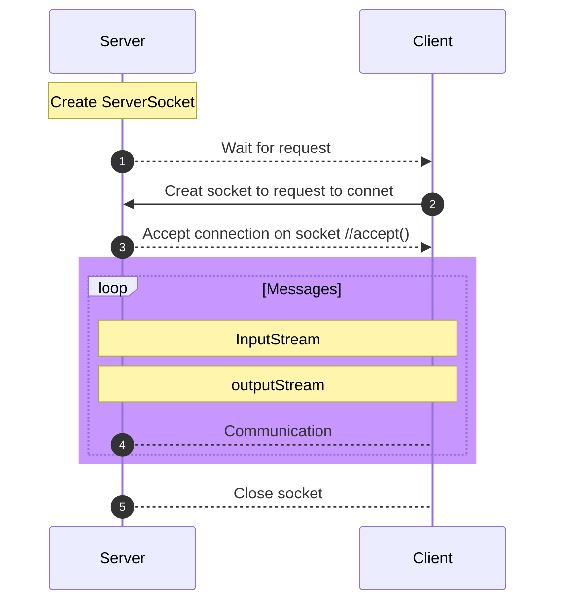

# Duke-ECE-650

This is Zhe Fan's ECE650 Project Repository.

# Table of Contents

- [Malloc Library](#Malloc-Library)
  - [Implementation Description](#Implementation-Description)
    - [Malloc](#Malloc)
    - [Free](#Free)
  - [Performance Result Presentation and Analysis](#Performance-Result-Presentation-and-Analysis)
- [Thread-Safe Malloc](#Thread-Safe-Malloc)
  - [Implementation Description](#Implementation-Description-1)
    - [Lock-Based](#Lock-Based)
    - [Non-Lock-Based](#Non-Lock-Based)
  - [Performance Result Presentation and Analysis](#Performance-Result-Presentation-and-Analysis-1)
- [TCP Socket Programming](#TCP-Socket-Programming)
  - [Socket Overview](#Socket-Overview)
  - [Implementation Description](#Implementation-Description-2)
## Malloc Library

For this assignment, I will implement my own version of several memory allocation functions from the C standard library. This implementation is to be done in C code. The C standard library includes 4 malloc reallrelated library functions: malloc(), free(), calloc(), and oc(). In this assignment, I implement versions of malloc() and free(): 
```
void *malloc(size_t size); 
void free(void *ptr); 
```
Essentially, malloc() takes in a size (number of bytes) for a memory allocation, locates an address in the program’s data region where there is enough space to fit the specified number of bytes, and returns this address for use by the calling program. 
The free() function takes an address (that was returned by a previous malloc operation) and marks that data region as available again for use.

The task is to implement 2 versions of malloc and free, each based on a different strategy for
determining the memory region to allocate. The two strategies are:
1. **First Fit**: Examine the free space tracker (e.g. free list), and allocate an address from
the first free region with enough space to fit the requested allocation size.
2. **Best Fit**: Examine all of the free space information, and allocate an address from the
free region which has the smallest number of bytes greater than or equal to the
requested allocation size.

Details of requirement can be found in [Project1.pdf](Project_1_Malloc_Library/Project1.pdf)

### Implementation Description

#### Malloc

  For each space chunk, I define a struct using **Double LinkedList** to know the **size** of the chunk, whether or not it's **free**, and what the **next** and **previous** chunk.
  
```
struct chunk_meta {
  size_t size;               //the size of this chunk
  int free;                  //it is free or not
  struct chunk_meta * next;
  struct chunk_meta * prev;
};
typedef struct chunk_meta chunk
```
  
  I also define two variable to record the head and tail of free list:
  
```
chunk * free_region_Start = NULL;
chunk * free_region_End = NULL;
```
  
  For malloc, space should only be allocated when existing space is not enough. Thus given that we have this linked list structure, checking if we have a free chunk and return it. When we get a request of some size, we iterate through our linked list to see if there's a free chunk that's large enough.

 In details, when the chunk is large enough, I also need to reuse free space efficiently if possible. To implementaion that, given that I have LinkedList, we can using splitting and merging.
 
If we don't find a free block, we'll have to request space using sbrk to allocate space.

#### Free

For free(), first I upadate the size of the chunk and make the **free** = 1, then check the previous and next chunk if free or not, if free, then merge them.

### Performance Result Presentation and Analysis


From the Table above, we can see that for small range size, the execution time of Best Fit is less than that of First Fit. This is due to that in the figure above, if we first want to use 2 free chunks, finally the 3rd request will return that there is not enough space, which leading to call the sbrk() to request space from OS. However, calling sbrk() is more time-consuming than directly using free chunks in small range of size. While Best Fit will find the free chunk with minimum suitable space so that it will use all free chunks efficiently.

For equal range size, the two methods show that they have close execution time and fragmentation. This is because for equal range size, two methods run in the same way. Best Fit behaves in the same way as First Fit does namely.

For large range size, though Best Fit is faster than First Fit in small range size, iterating to find the free chunk with minimum suitable space in a large range will cost more time than sbrk(). Thus First Fit is faster than Best Fit in large range size.

## Thread-Safe Malloc

### Implementation Description

For this assignment, I implemented my own version of two different thread-safe versions (i.e. safe for concurrent access by different threads of a process) of the malloc() and free() functions. This is to solve problems like race conditions, which means that incorrect parallelcode may (sometimes often) result in correct execution due to the absence of certain timingconditions in which the bugs can manifest.

#### Lock-Based
For Lock-Based version, we should put lock before and after malloc() and free(), function pthread\_mutex\_lock() will prevent running simultaneously, which allows concurrency for malloc() and free().

#### Non-Lock-Based
For Non-Lock-Based version, we only put lock before and after sbrk(). And each time we use a new list to represent the free chunk, which means every free chunk is independent on each other, without overlapping memory region.

### Performance Result Presentation and Analysis

| *Average for 50 times tests|    Lock     | Non-Lock |
| --| ----------- | ----- |
| Execution Time(s) | 0.109     | 0.178  |
| *Data segment size(bytes)| 43251424 | 44433824 |


For Execution Time, Non-Lock is faster than Lock. According to Section 1, Non-Lock only lock sbrk(), but all other operations will happen simultaneously. However, for Lock-version, it locks the malloc() and free() which makes less code run simultaneously. Therefore, Lock-Based is faster.
	
For Data segment size, Lock-Based and Non-Lock-Based have close size, which means they behavior similarly in find free chunk.

## TCP Socket Programming

### Socket Overview

**What should Server do:** 
- Create a ServerSocket object and bind the listening port
- Call the accept() method to monitor the client's request
- After the connection is established, read the request information sent by the client through the input stream
- Send response information to the client through the output stream
- Close related resources

**What should Client do:**
- Create a Socket object, indicating the address and port number of the server to be linked
- After the link is established, send request information to the server through the output stream
- Get the server response information through the output stream
- Close related resources


### Implementation Description

The game that will be modeled is called hot potato, in which there are some number of players who quickly toss a potato from one player to another until, at a random point, the game ends and the player holding the potato is “it”. The object is to not be the one holding the potato at the end of the game. In this assignment, you will create a ring of “player” processes that will pass the potato around. Thus, each player process has a left neighbor and a right neighbor. Also, there will be a “ringmaster” process that will start each game, report the results, and shut down the game.

The game that you will work on follows the following process:
1. To begin, the ringmaster creates a “potato” object initialized with some number of hops and sends the potato to a randomly selected player.
2. Each time a player receives the potato, the player will decrement the number of hops and append the player’s ID (which is the id number assigned to each player as described in the Communication Machanism section below) to the potato. Then, this player who is holding the potato will choose next step based on the remaining number of hops as bellow:
- If the remaining number of hops is greater than zero, the player will randomly select a neighbor and send the potato to that neighbor.
- The game ends when the hop counter reaches zero. The player holding the potato sends it to the ringmaster, indicating the end of the game. The ringmaster prints a trace of the game to the screen (using the player identities that are appended to the potato), and shuts the game down (by sending a message to each player to indicate they may shut down as the game is over). 

The assignment is to create one ringmaster process and some number of player processes, then play a game and terminate all the processes gracefully. You may explicitly create each process from an interactive shell; however, the player processes must exit cleanly at the end of the game in response to commands from the ringmaster.
	
Based on the description above, the ringmaster side will be responsible for the following:
1. Establish N network socket connections with N number of players and provide relevant
information to each player (see Communication Machanism section below for details)
2. Create a “potato” object as described above
3. Randomly select a player and send the “potato” to the selected player
4. At the end of the game (when the ringmaster receive the potato from the player who is
“it”), print a trace of the potato to the screen
5. Shut the game down by sending a message to each player

The player side will be responsible for the following:
1. Establish three network socket connections for communication:
- with the player to the left
- with the player to the right
- with the ringmaster
2. Keep listening to the three channels as “potato” can arrive on any of these three
channels. Note that commands and important information may also be received from the
ringmaster.
3. Properly handle everything received based on game rules.
